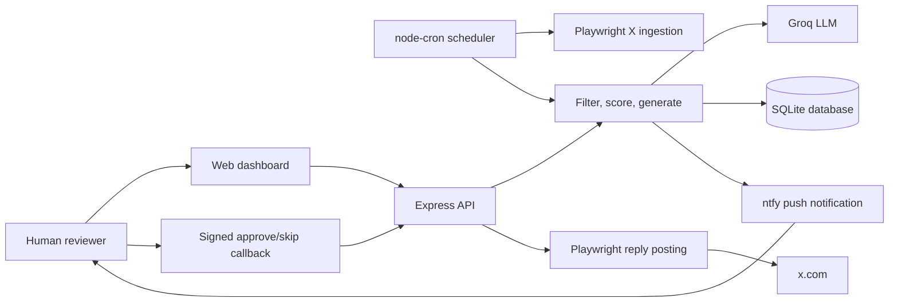

# Xposter

Xposter is a local, human-in-the-loop assistant for discovering relevant X/Twitter posts, drafting short Puneri-style replies, and asking for explicit approval before anything is posted.

## Mission

Help a real person engage with local Pune and Marathi conversations quickly, safely, and with personality, while preserving human approval as the final control point.

## Vision

Build a lightweight personal engagement copilot that feels local, context-aware, funny without being reckless, and operationally transparent enough to trust.

## Objectives

- Collect posts from the authenticated X timeline using a persistent local Playwright browser profile.
- Filter and score Marathi/English posts around Pune, civic issues, traffic, rain, local events, and public conversation.
- Generate concise replies with gentle Puneri wit: dry, observant, lightly satirical, and low-risk.
- Send approval notifications to an iPhone through ntfy.
- Post only after an explicit Approve action.
- Keep secrets, browser cookies, local databases, logs, and generated artifacts out of Git.
- Run automatically five times a day by default.

## License

This project is licensed under the GNU General Public License v3.0 or later. See [LICENSE](./LICENSE).

## Quick Start

### Prerequisites

- Node.js 20 or newer.
- A Groq API key.
- Chromium installed through Playwright.
- An ntfy topic subscribed in the iOS ntfy app.
- A logged-in X session in the local Playwright browser profile.

### Install

```bash
npm run setup
```

### Configure

Copy the example env file:

```bash
cp .env.example .env
```

Set at least:

```env
GROQ_API_KEY=replace_me_with_groq_api_key
API_KEY=replace_with_openssl_rand_hex_32
NTFY_TOPIC=your-private-ntfy-topic
CALLBACK_BASE_URL=http://<your-mac-lan-ip>:3000
BROWSER_HEADLESS=false
```

Generate a strong API key:

```bash
openssl rand -hex 32
```

Find your Mac LAN IP:

```bash
route -n get default 2>/dev/null | awk '/interface:/{print $2}' | xargs -I{} ipconfig getifaddr {}
```

### First X Login

Run once with a visible browser:

```bash
BROWSER_HEADLESS=false npm run dev
```

Log in to `x.com` in the Playwright-controlled Chromium window. The session is stored under `browser-profile/`, which is intentionally ignored by Git.

### Run

```bash
npm run dev
```

Open the dashboard:

```text
http://localhost:3000
```

From your iPhone on the same WiFi:

```text
http://<your-mac-lan-ip>:3000
```

From your iPhone anywhere with Tailscale:

```text
http://<your-mac-tailscale-ip>:3000
```

### Production-Style Run

```bash
npm run build
npm start
```

## Scheduling

By default, Xposter runs five automatic ingestion/generation cycles per day:

```cron
0 9,12,15,18,21 * * *
```

Override this with `INGEST_CRON` in `.env`.

## ntfy Approval Flow

Xposter sends ntfy notifications with iOS-safe `view` actions by default:

```env
NTFY_ACTION_MODE=view
```

The action buttons open signed local callback URLs. The signed token is scoped to one post and one action, expires automatically, and avoids putting the full API key in notification URLs.

If you prefer silent background callbacks and your network/device supports them, set:

```env
NTFY_ACTION_MODE=http
```

## Tailscale Anywhere Access

Tailscale lets your iPhone reach the dashboard when you are away from home without exposing Xposter to the public internet.

1. Install Tailscale on the Mac from the official download page or Mac App Store.
2. Sign in to Tailscale on the Mac.
3. Install Tailscale on the iPhone from the App Store.
4. Sign in to the same Tailscale account on the iPhone.
5. On the Mac, find the Tailscale IP:

```bash
tailscale ip -4
```

If the CLI is not installed, copy the Mac's `100.x.y.z` address from the Tailscale app UI.

6. Configure `.env`:

```env
HOST=0.0.0.0
CALLBACK_NETWORK=tailscale
CALLBACK_BASE_URL=
TAILSCALE_IP=<optional-mac-100.x.y.z-if-cli-is-unavailable>
TRUST_DASHBOARD_ORIGIN=true
```

7. Restart Xposter:

```bash
npm run dev
```

8. Open this on the iPhone while Tailscale VPN is connected:

```text
http://<mac-100.x.y.z>:3000
```

The dashboard should not ask for the API key when opened from the app's own Tailscale URL. ntfy approval links will also use the Tailscale callback URL.

## Architecture



More Mermaid source files live in [docs/diagrams](./docs/diagrams):

- [system-architecture.mmd](./docs/diagrams/system-architecture.mmd)
- [pipeline-flow.mmd](./docs/diagrams/pipeline-flow.mmd)
- [approval-sequence.mmd](./docs/diagrams/approval-sequence.mmd)
- [ntfy-action-sequence.mmd](./docs/diagrams/ntfy-action-sequence.mmd)
- [posting-sequence.mmd](./docs/diagrams/posting-sequence.mmd)
- [security-model.mmd](./docs/diagrams/security-model.mmd)

The security review and remediation notes are in [docs/security-review.md](./docs/security-review.md).

## Project Structure

```text
src/
  api/                 Express server, API routes, auth helpers
  browser/             Playwright session, ingestion, reply posting
  notifications/       ntfy notification publisher
  pipeline/            filtering, scoring, reply generation
  scheduler/           cron orchestration
  storage/             SQLite schema and queries
  utils/               logging, network, tweet URL helpers
public/                dashboard UI
tests/                 unit and integration tests
docs/diagrams/         Mermaid architecture and sequence diagrams
```

## Security Notes

- `.env`, browser profiles, SQLite data, logs, build output, and dependencies are ignored by Git.
- Mutation endpoints require the API key unless called from loopback.
- Off-Mac dashboard mutations are allowed from the app's own LAN/Tailscale origin when `TRUST_DASHBOARD_ORIGIN=true`; otherwise they prompt for the API key and store it in that browser's localStorage.
- ntfy `view` links use signed action tokens instead of exposing the full API key.
- Request logs redact `key` and `token` query parameters.
- JSON request bodies are size-limited.
- CORS is restricted to localhost and configured local callback origins.
- Generated replies remain pending until human approval.

## Useful Commands

```bash
npm run build
npm test
npm run dev
npm start
```

## Operational Checklist

- Confirm `http://localhost:3000/health` returns `ok`.
- Confirm your iPhone can open `http://<your-mac-lan-ip>:3000`.
- Send a test ntfy notification from the dashboard settings tab.
- Confirm Approve opens a local confirmation page and then posts.
- Keep `API_KEY`, `GROQ_API_KEY`, `browser-profile/`, and `data/` private.
